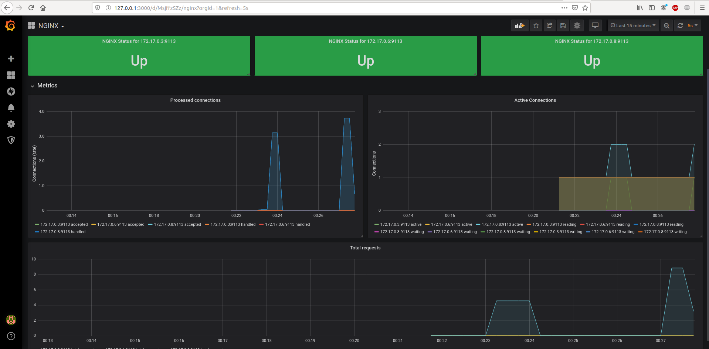

# Выполнено ДЗ № 8

 - [x] Основное ДЗ
 - [ ] Задание со *

## В процессе сделано:
 - Собран контейнер nginx отдающий свои метрики и развернут в minikube.
 - Развернут nginx exporter который преобразовывает метрики для prometheus.
 - Развернут мониторингю.

 - Перед проверкой, minikube необходимо запустить с определенными параметрами
```
minikube start --vm-driver=kvm2 --disk-size=7Gb --cpus=4 --memory=8192   # --vm-driver=none если не используем гипервизор на хосте
```
 - Создаем пространство для мониторинга
```
kubectl create ns monitoring
```
 - Создаем CRDs
```
kubectl apply -f https://raw.githubusercontent.com/coreos/prometheus-operator/release-0.35/example/prometheus-operator-crd/monitoring.coreos.com_alertmanagers.yaml
kubectl apply -f https://raw.githubusercontent.com/coreos/prometheus-operator/release-0.35/example/prometheus-operator-crd/monitoring.coreos.com_podmonitors.yaml
kubectl apply -f https://raw.githubusercontent.com/coreos/prometheus-operator/release-0.35/example/prometheus-operator-crd/monitoring.coreos.com_prometheuses.yaml
kubectl apply -f https://raw.githubusercontent.com/coreos/prometheus-operator/release-0.35/example/prometheus-operator-crd/monitoring.coreos.com_prometheusrules.yaml
kubectl apply -f https://raw.githubusercontent.com/coreos/prometheus-operator/release-0.35/example/prometheus-operator-crd/monitoring.coreos.com_servicemonitors.yaml
```
Ждем пока создаются CRDs, это занимает немного времени
 - Установим chart, но без CRD указав в командной строке prometheusOperator.createCustomResource=false, создаем values.yaml где описаваем переменные
```
helm install stable/prometheus-operator --namespace=monitoring --set prometheusOperator.createCustomResource=false -f values.yaml --generate-name
```
 - Разворачиваем deployment.yaml, service.yaml.
 - Разворачиваем servicemonitor.yaml.
 - Смотрим пароль от grafana
```
kubectl get secret -n monitoring prometheus-operator-1582488874-grafana -o jsonpath="{.data.admin-password}" | base64 --decode; echo
```
 - Заходим в grafana и импортируем dashboard.json (https://github.com/nginxinc/nginx-prometheus-exporter/tree/master/grafana), смотрим на график. 
```
kubectl port-forward -n monitoring prometheus-operator-1582488874-grafana-6f8d764f9f-m48xq 3000:3000
```


 - Если график не строится, то можно сходить на вэб-интерфейс prometheus и посмотреть в меню Service Discovery, если не опрелелил nginx ищим ошибку и исправляем.
```
kubectl port-forward -n monitoring prometheus-prometheus-operator-158248-prometheus-0 9090:9090
```

## Как проверить работоспособность:
 - Для того чтобы график начал строится и отображал запросы, необходимо сделать несколько запросов к nginx (не важно какому)
```
kubectl exec -it nginx-status-6668cfdff-dv7tj curl 127.0.0.1:8088
```
 - Зайти на вэб-интерфейс Grafana
```
kubectl port-forward -n monitoring prometheus-operator-1582488874-grafana-6f8d764f9f-m48xq 3000:3000
```
 127.0.0.1:3000, импортировать dashboard.json и отобразится график

## PR checklist:
 - [x] Выставлен label с номером домашнего задания
